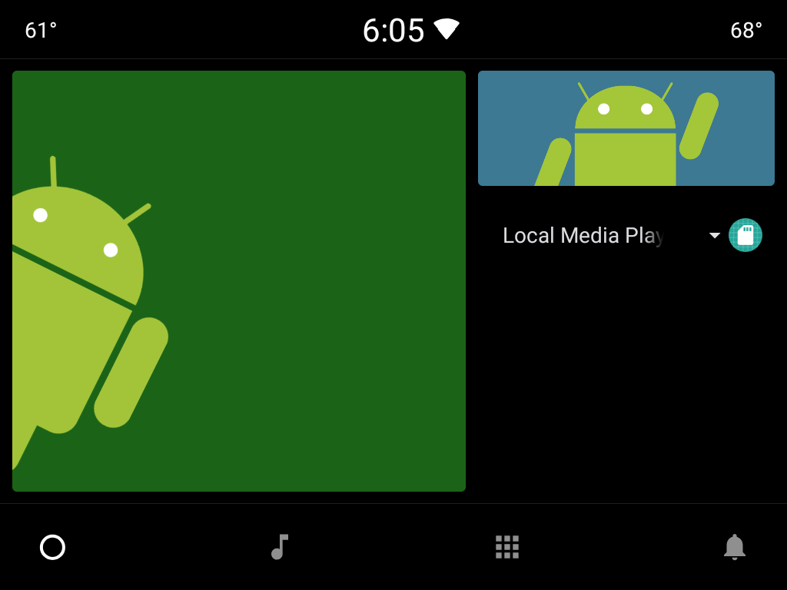
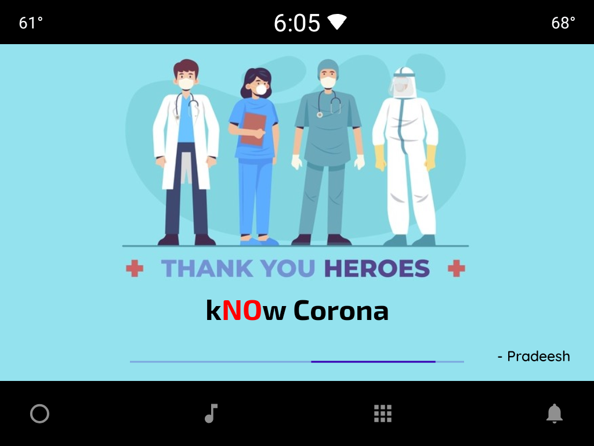
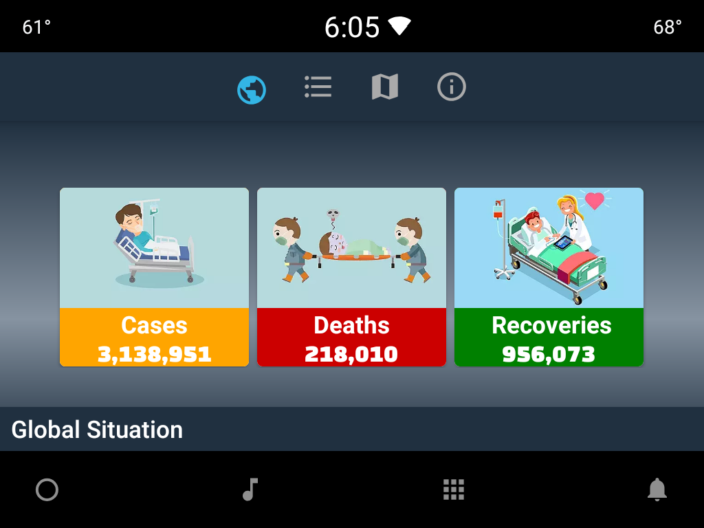
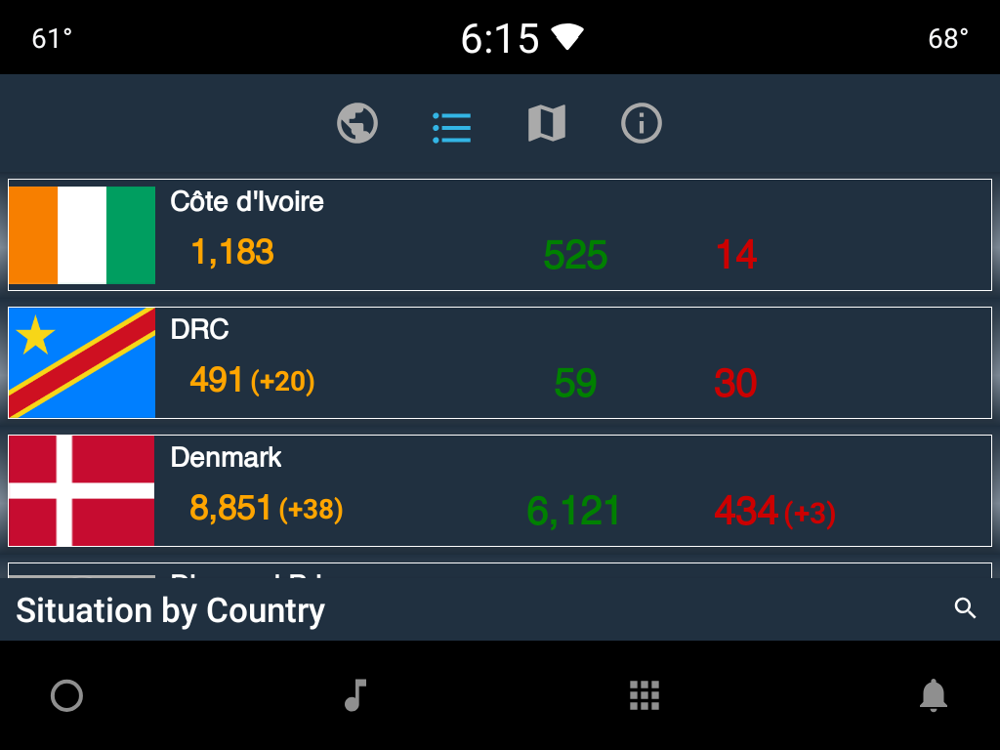
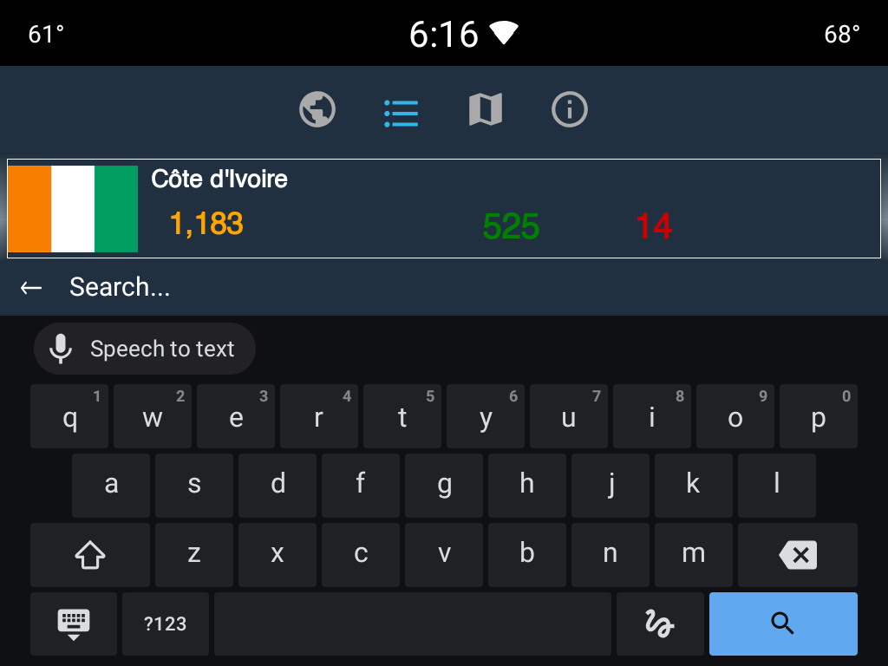
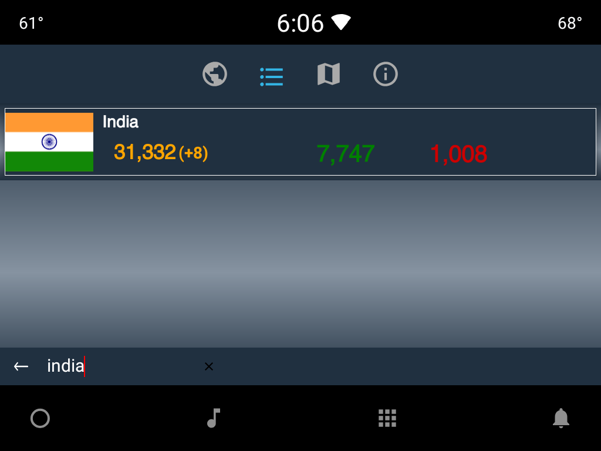
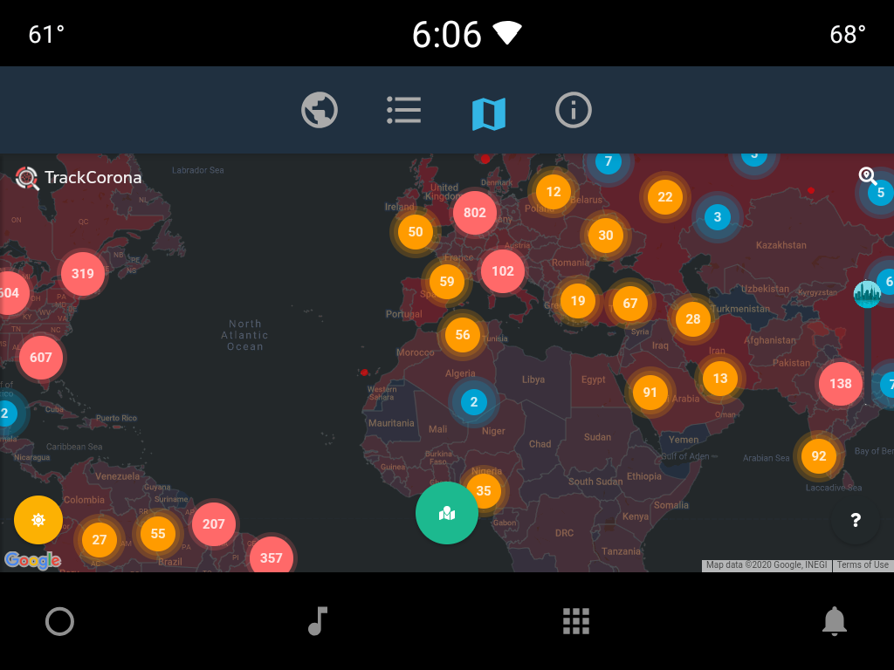
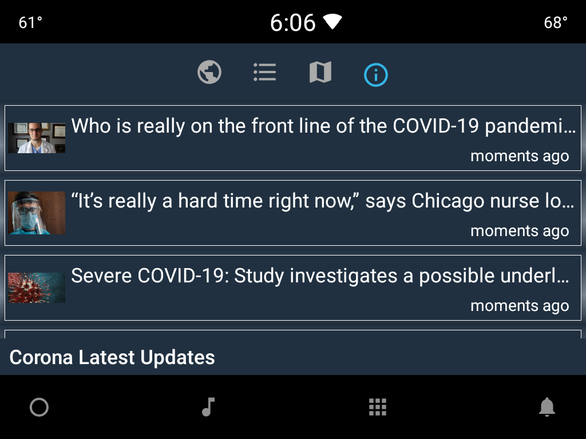
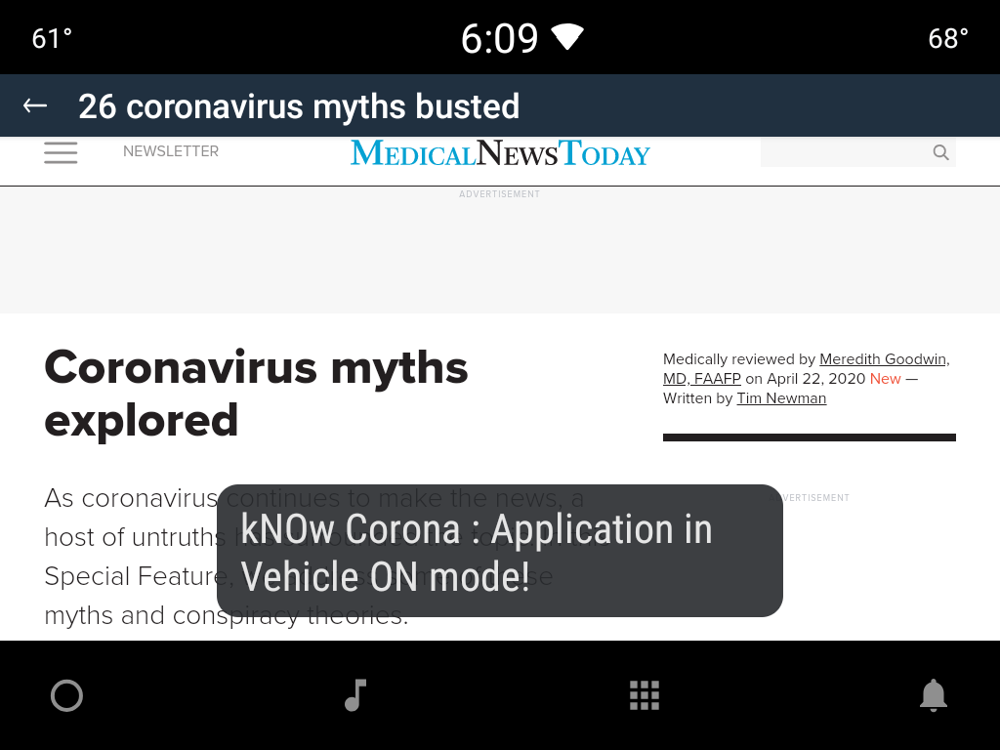

# kNOw Corona

**kNOw Corona** is the first android powered application for Android Automotive infotainment devices .
Developed based on latest Android Architecture componenets with CAN(Car API) data(Emulator control - Car sensor data) utilization.

Its an real time application fetches latest Covid19 cases data all over the world, thanks to [NovelCovid](https://github.com/NovelCOVID/API) for the API.

## Features 🧾 
- Global Cases : Shows Total Covid-19 cases in the world from API
- Country : User can search for a particular country to get latest Total, Recovered and Deceased cases. 
- Map view : Shows Covid-19 cases in an map view
- Covid News : Shows latest news specifically about Covid-19, user can see the news in detailed by clicking it.

## Automotive Features 🚗
- RSS TTS : If the user was in News Page and trying to access the car by ignition ON, the application will automatically starts reading(Text to speech) the news.

> Criteria : Ignition ON + (Vehicle Speed > 10)

## Screenshots 📷

|    |            |   |
|:----------:|:-------------:|:------:|
| *AA HMI* |  *Splash HMI* | *Home HMI* |

|    |            |   |
|:----------:|:-------------:|:------:|
| *Countries HMI* |  *Search Country HMI* | *Search Country Result HMI* |

|    |            |   |
|:----------:|:-------------:|:------:|
| *Map HMI* |  *RSS-Corona News HMI* | *RSS - Detailed(Vehicle Criteria ON) HMI* |

## Demo 🎥
|  |
|:----------:|

